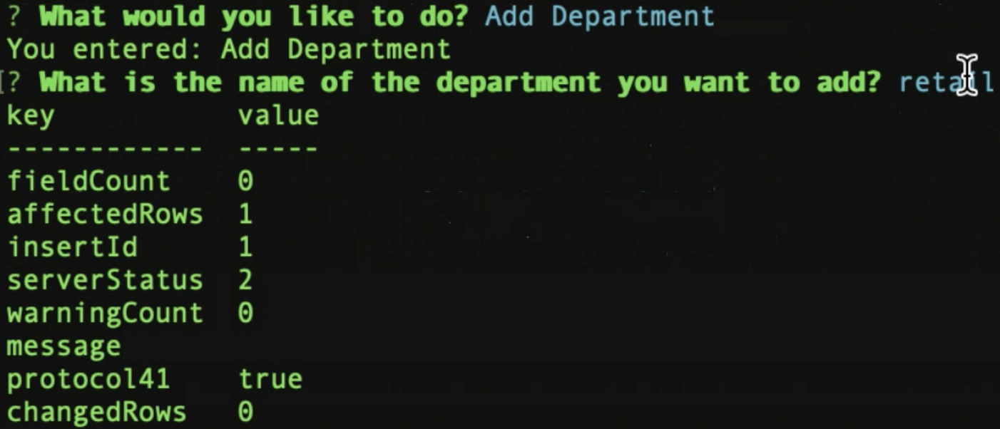
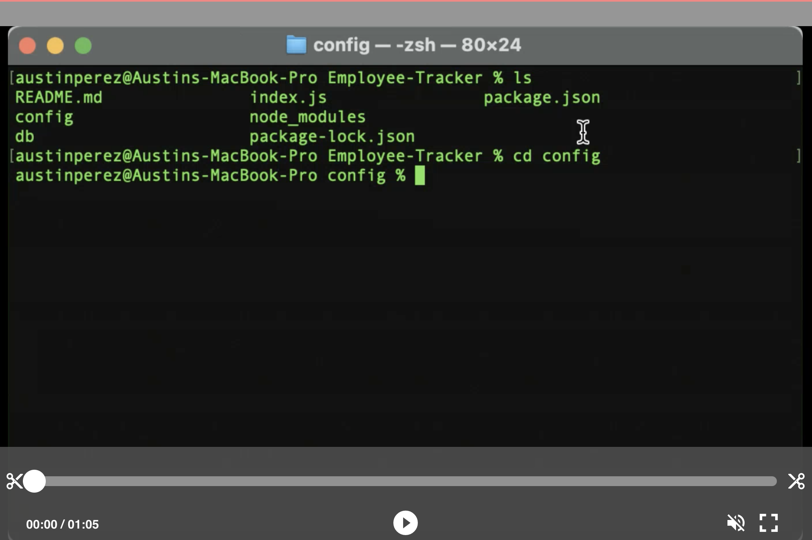

# Employee-Tracker

  
  

---

## Table of Contents

- [Description](#description)
- [Installation](#installation)
- [Usage](#usage)
- [License](#license)

 

## Description

Manage and keep track of all your employees using my Emplyee Tracker apllication! This application allows you to add new employees within a current database and also allows for users to update or manage employee information.
 

## Instalation

 
This is a CLI specific application and will require users to use an CLI of choice. 
 
 
Users should make sure that Node.js and MySQL are installed on their local machines. Your personal MySQL password must also be entered into the connection.js file in order to create the necessary database and connection within MySQL. Preset or fill data is supplied within the seeds.sql file.

 
 

## Usage

 

- Within the terminal cd into the config folder and run npm server to launch the application.
   
- Once application is running you will be presented with a series of prompts to follow. use arrow keys to navigate through prompts. Prompts will consist of adding, viewing, or updating employee information. Use the enter key to select an option.
   
- Information that the user enters in regards to updating, viewing, or managing employees and job related roles is organized within a table.
   
- Users can navigate throughout the prompts and see any new additions to the fields.
   
- To stop the app simply navigate to the exit button and the application will end.
   

* Please feel free to follow along with this video that walks you through the application.

## License

[MIT](https://choosealicense.com/licenses/mit/#)
